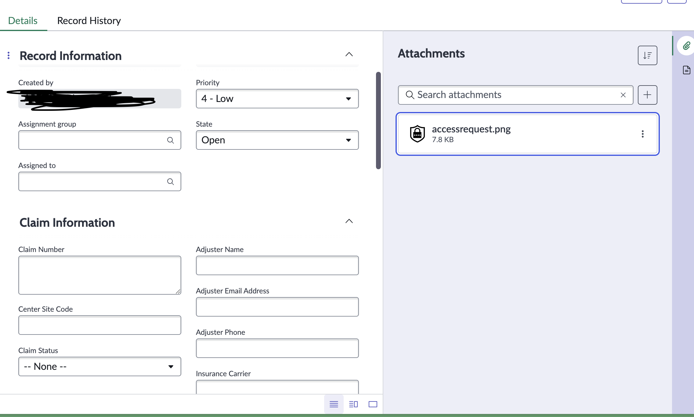
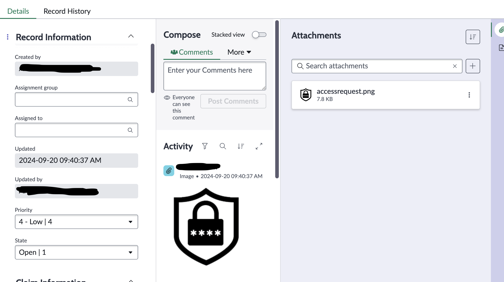

# Activities and Compose not Displaying in Custom 

### Form Layout

### Creator: [@ben-meeker](https://github.com/ben-meeker)

When updating a workspace form view, or creating a new workspace in a custom app, sometimes the workspace view won't display (shown below). 

## The Fix

* Navigate to the record outside of the workspace (<custom table name>.list)
* Open the context menu on the record, and select `Configure` -> `Form Layout` 
* Ensure that the following fields are included somewhere on the form layout. If any of these are missing, the compose section will not display, or will be missing the `Additional Comments` or `Work Notes` field.
    - Additional Comments
    - Work Notes
    - Activities (Filtered)

After setting this configuration you should have the compose and activity stream section show!

