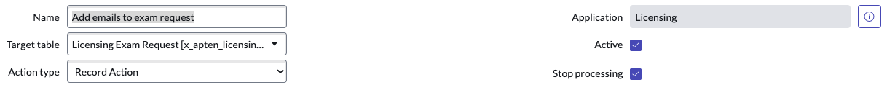
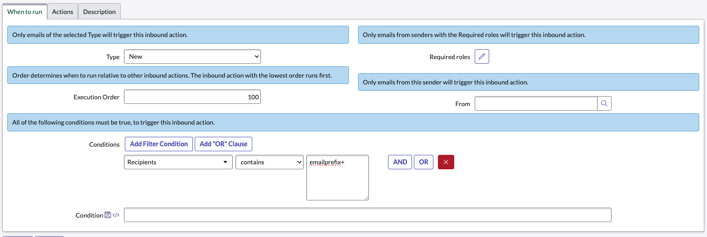

# Add Emails to Comments on Custom Table

### Inbound Action

### Creator: [@ben-meeker](https://github.com/ben-meeker)

Create an inbound action that will add emails and attachments to a record on a custom table.

## Getting Started

### Email Setup

1. Create an email or group, and forward emails to `<instance>@service-now.com`

### Inbound Action

#### Record Information



#### When to Run



Make sure to set the conditions to `Recipients` `Contains` `<emailprefix>+`

This will allow us to send emails to addresses like `emailprefix+CLA001008@company.com` where each record is specified in the email.

#### Actions

Set the scrip value to the following, and modify as needed:

```javascript
(function runAction(/*GlideRecord*/ current, /*GlideRecord*/ event, /*EmailWrapper*/ email, /*ScopedEmailLogger*/ logger, /*EmailClassifier*/ classifier) {

// Get the record number from the recipient email
var recordNumber = /<email prefix>.(.+)@/g.exec(email.recipients)[1].trim();

// Find the corresponding record
var record = new GlideRecord('<custom table>');
record.addQuery('number', recordNumber);
record.query();

// Copy attachments and body from email to record
if (record.next()) {
	GlideSysAttachment.copy('sys_email', sys_email.sys_id, '<custom table>', record.sys_id);
	record.comments = email.body_text;
	record.update();
}

})(current, event, email, logger, classifier);
```

#### Description

Give a relevant description of the inbound action.

### Disclaimer

Duplicate this inbound action for types `Reply` and `Forward` as needed.