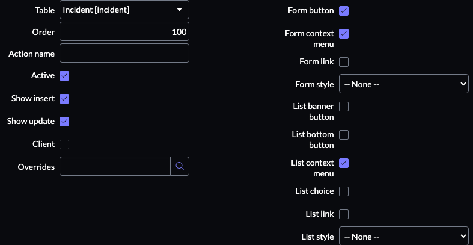
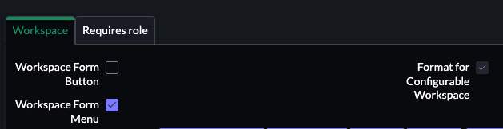

# Custom UI action to call subflow in workspace

### UI Action

### Creator: [@brealPhrojoe](https://github.com/realPhrojoe)

Creating a UI action that calls a subflow that can be clicked in both form view and workspace

## Getting Started

* Create a subflow
* Create a UI action
  - Give your UI action a name and table
  - Populate fields with the following settings. Alter as needed.
     
  - Set condition field (e.g. `current.assignment_group=='some assignment group sys_id'`) 
    This example only shows the UI action for incidents in this assignment group.
  - Set the script field
    ```javascript
    (function() {
      // set inputs for subflow
      var inputs = {};
      inputs['short_description'] = current.short_description;
      inputs['description'] = current.description;

      // call subflow with inputs
      sn_fd.FlowAPI.getRunner().subflow('global.my_subflow').inForeground().withInputs(inputs).run();

      // log work notes
      current.work_notes = gs.getUserDisplayName() + " has ran a ui action.";
      current.update();

      // redirect back to incident
      action.setRedirectURL(current); 
    })();
    ```
    - Set Workspace Configuration
    
    

