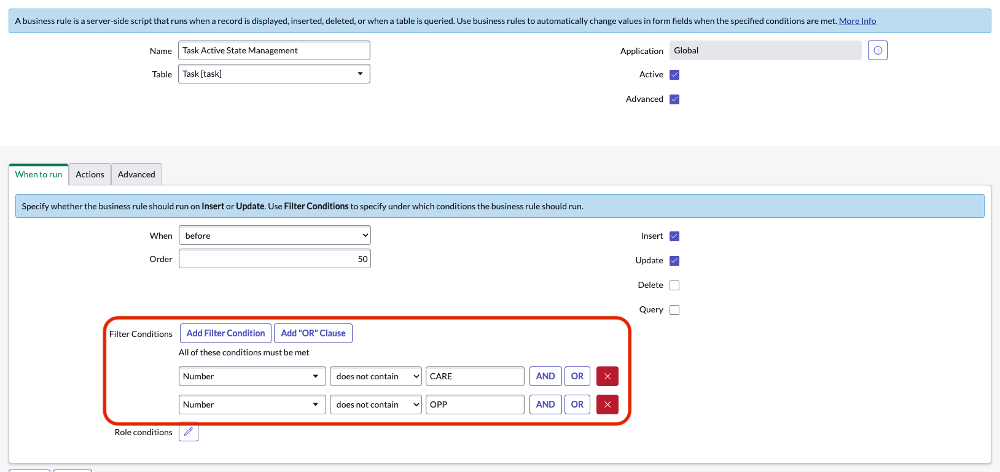

# Disable Active State Management for Custom Task Table

### Business Rule

### Creator: [@ben-meeker](https://github.com/ben-meeker)

This showcases what business rule handles active state managemnet on task extended tables, based on close states, and how to disable it for a custom task table.
  
### Disable active state management

Navigate to the business rule `Task Active State Management` or go to `https://<your instance name>.service-now.com/now/nav/ui/classic/params/target/sys_script.do%3Fsys_id%3D9782b8dac0a80a6d75bf2167f4ec8bc6%26sysparm_record_rows%3D45%26sysparm_record_scope%3Dglobal%26sysparm_record_target%3Dsys_script%26sysparm_record_list%3Dsys_updated_byCONTAINSben%255EORDERBYDESCsys_updated_on%26sysparm_nostack%3Dtrue%26sysparm_record_row%3D3`

Ensure your custom table has numbering enabled, or some other criteria on the record, that can identify your table.

Set the following condition, with your respective numbering prefix
