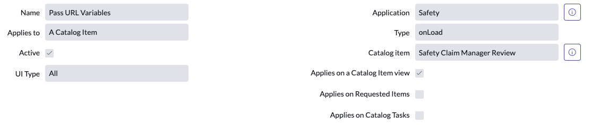

# Pass URL Variables to Catalog Item

### Catalog Client Script

### Creator: [@ben-meeker](https://github.com/ben-meeker)

This is a catalog client script that allows you to pass parameters in your URL to auto-fill values in a catalog item.

## Getting Started

* Create a catalog item.
* Set field values as shown:

    - Applies to: `A Catalog Item`
    - Active: `True`
    - UI Type: `All`
    - Type: `onLoad`
    - Applies on a Catalog Item view: `True`
* Set script field to the following:
```javascript
function onLoad() {
    // Create a variable with the value of the parameter given in the URL.
    var some_variable = getParameterValue("some_variable");
    g_form.setValue('some-variable', some_variable);

    // Repeat as needed for additional variables
    var some_other_variable = getParameterValue("some_other_variable");
    g_form.setValue('some_other_variable', some_other_variable);

    // Function to parse parameters and get values from URL
    function getParameterValue(name) {
        name = name.replace(/[\[]/, "\\\[").replace(/[\]]/, "\\\]");
        var regexS = "[\\?&]" + name + "=([^&#]*)";
        var regex = new RegExp(regexS);
        var results = regex.exec(top.location);
        if (results == null) {
            return "";
        } else {
            return unescape(results[1]);
        }
    }
}
```

## Usage

Parameters are used in the url with the following syntax: `https://<instance-name>.service-now.com/<path-to-catalog-item>&some_variable=<some value>&some_other_variable=<some other value>`