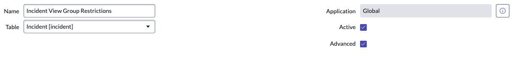
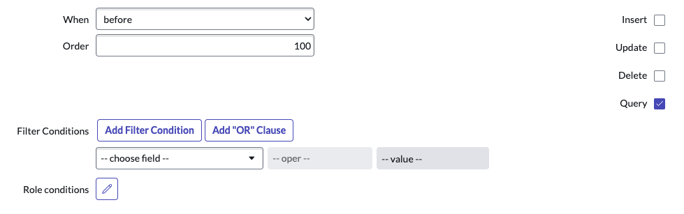

# Restrict Incident View to Assignment Group

### Business Rule   

### Creator: [@ben-meeker](https://github.com/ben-meeker) A creator tag with your @ linked to your github

Restrict incidents so that agents can only see incidents that are assigned to a group they are a part of. This is helpful if you have multiple departments or teams working inside of the incident table, and you don't want them to be able to view eachothers tickets.

## Getting Started

* Create a new Business Rule
* Configure as shown:

### Details



### When to run



### Actions


### Advanced

#### Condition

`!gs.hasRole('admin') && gs.hasRole('itil') && gs.getSession().isInteractive()`

This conditions ensures the business rule only acts on non-admins that have the itil role. and are using ServiceNow in an interactive sessions (not via API).

#### Script

```javascript
(function onBefore(current, previous /*null when async*/ ) {

	var usrGroupsString = "";
    var usrGroups = gs.getUser().getMyGroups().toArray();
	for (var i = 0; i < usrGroups.length; i++) {
		usrGroupsString += usrGroups[i]+",";
	} 
	var u = gs.getUserID();
    current.addQuery("assignment_group", "IN", usrGroupsString).addOrCondition("caller_id", u).addOrCondition("watch_list", "CONTAINS", u);

})(current, previous);
```

This script gets the groups the agent is a part of, and checks to see if the incident they are trying to load is assigned to one of those groups, or if the agent is the caller or on the watch list of the incident.